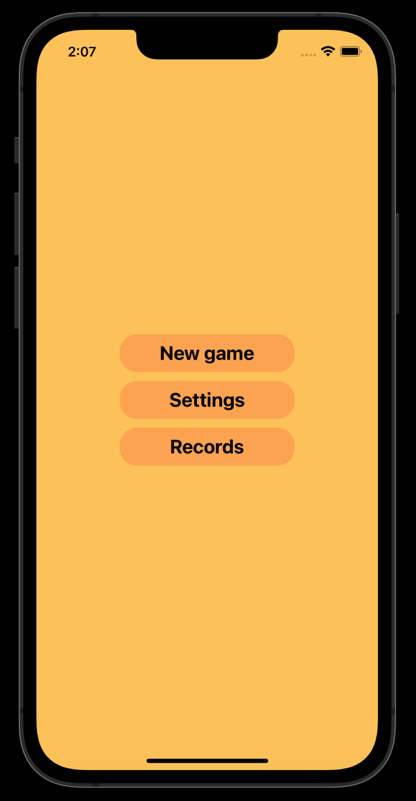
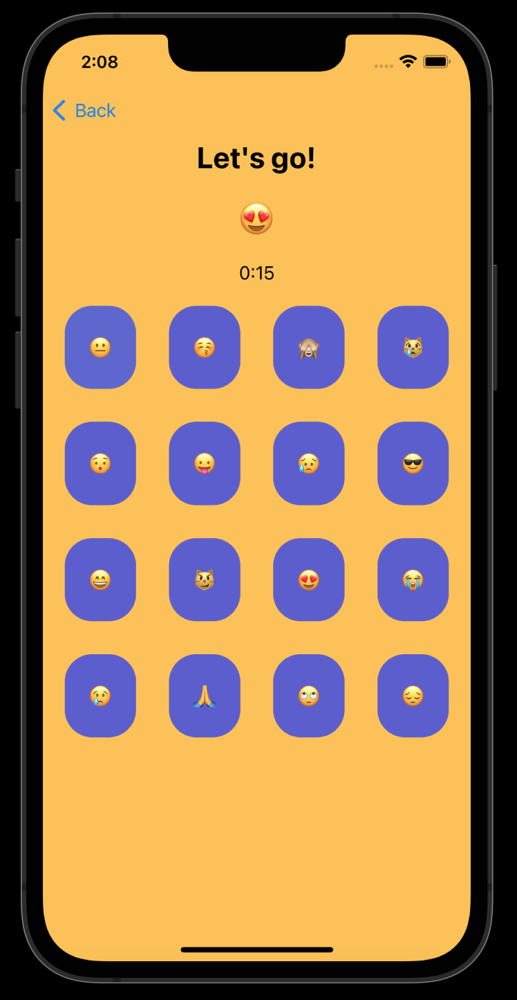

# Game find emoji UIKit swift


# Game find emoji

PET project: game UIKit swift


---
In this project, I decided to create a game. By pressing the start button, the timer starts and emoji cards appear. 
The player's task is to find all the emojis that the game offers. The gameplay complicates the timer. 


###
<table>
  <tr>
    <td></td>
    <td></td>
</table>

### About it
- This is my PET project on Swift
- This is a game where you have to find all the emoji in a certain amount of time
- The application logic is based on the MVC pattern

### Functionality
- The app has multiple screens. Menu screen, game screen, settings screen
- Handled all edge cases such as game time out, wrong emoji selected
- The application uses UserDefaults to store the user's settings
- You can configure the presence of a timer and its length

### Installation

1. Clone the repo via git clone command
```
https://github.com/MustafaNatur/Game-find-emoji-UIKit-swift.git
```
2. Open in Xcode
```
open Game find emoji.xcodeproj
```
